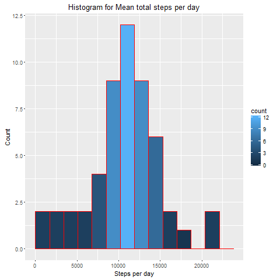

# Reproducible Research: Peer Assessment 1

The analysis makes use of data from a personal activity monitoring device, such 
as a Fitbit, Nike Fuelband, or Jawbone Up. This device collects data at 5 minute
intervals through out the day. The data consists of two months of data from an 
anonymous individual collected during the months of October and November, 2012 
and include the number of steps taken in 5 minute intervals each day


The dataset for the analysis can be downloaded from the following link: 
[Activity monitoring data](https://d396qusza40orc.cloudfront.net/repdata%2Fdata%2Factivity.zip)


The dataset is stored in a comma-separated-value (CSV) file and there
are a total of 17,568 observations in this dataset. 
The variables included in this dataset are:

* _steps_ : Number of steps taking in a 5-minute interval (missing values are 
coded as NA);
* _date_ : The date on which the measurement was taken in YYYY-MM-DD format;
* _interval_ : Identifier for the 5-minute interval in which measurement was 
taken.

All the figures in the analysis have been created with ```{r gg, echo=TRUE} ggplot2 ``` library.

-----------

   
## 1. Loading and preprocessing the data

### Load the data.

Read the data from the .csv file located in the "data" folder within the working 
directory.


```r
origData <- read.csv(file = "./data/activity.csv", 
                     header=TRUE, sep=",", stringsAsFactors = FALSE)
```


Perform a first basic analysis about the dataset, to have an idea how is organised.


```r
head(origData)
```

```
##   steps       date interval
## 1    NA 2012-10-01        0
## 2    NA 2012-10-01        5
## 3    NA 2012-10-01       10
## 4    NA 2012-10-01       15
## 5    NA 2012-10-01       20
## 6    NA 2012-10-01       25
```

```r
summary(origData)
```

```
##      steps            date              interval     
##  Min.   :  0.00   Length:17568       Min.   :   0.0  
##  1st Qu.:  0.00   Class :character   1st Qu.: 588.8  
##  Median :  0.00   Mode  :character   Median :1177.5  
##  Mean   : 37.38                      Mean   :1177.5  
##  3rd Qu.: 12.00                      3rd Qu.:1766.2  
##  Max.   :806.00                      Max.   :2355.0  
##  NA's   :2304
```

```r
dim(origData)
```

```
## [1] 17568     3
```


### Transform data to be suitable for the analysis


```r
origData$date <-as.Date(origData$date)
```

-----------
      

## 2. What is mean total number of steps taken per day?

### Calculate the total number of steps taken per day

The total number of steps taken per day is calculated by making use of one of
the aggregation function from the library ``` plyr ```. The function provides us with
the possibility to calculate other measures at the same time (_i.e.,mean, maximum_).


```r
library(plyr)
synthData <- ddply(origData, .(date), summarize,
                   total = sum(steps),
                   mean = round(mean(steps)),
                   maximum = max(steps))
head(synthData)                   
```

```
##         date total mean maximum
## 1 2012-10-01    NA   NA      NA
## 2 2012-10-02   126    0     117
## 3 2012-10-03 11352   39     613
## 4 2012-10-04 12116   42     547
## 5 2012-10-05 13294   46     555
## 6 2012-10-06 15420   54     526
```


The following figure shows the histogram of the total steps per day, created with 
the ``` ggplot2 ``` library.

 

The code generating the histogram is:


```r
library(ggplot2)
ggplot(data=synthData, aes(synthData$total)) +
        geom_histogram(breaks=seq(0, 25000, by=1700),
                       col="red", aes(fill=..count..)) +
        labs(x = "Steps per day", y = "Count") +
        labs(title="Histogram for Mean total steps per day")                   
```

```
## Warning: Removed 8 rows containing non-finite values (stat_bin).
```


The **mean** and **median** total number of steps taken per day are as follows:

 1. Mean --> NA
 2. Median --> NA


-----------

## 3. What is the average daily activity pattern?

The following figure shows the time series plot of the average number of steps 
taken (y-axis), averaged across all days, divided in the 5-minute intervals. 
The x-axes shows the progressive sum of the 5-minute interval, totaling a 24h day.

The blue point represents, on average across all the days in the dataset, the 
maximum number of steps which falls in the _104th_ 5-minute interval (835 minutes).

 


## 4. Imputing missing values

The strategy employed to fill in the missing values is to take the mean for the 
5-minute intervals, containing the number of steps averaged across all days. 
When calculating the mean, the rows containing the NAs values have not been 
considered (``` na.rm=TRUE ```).


```r
library(plyr)
imputedData <- ddply(origData, .(interval), function(df) {
        df$steps[is.na(df$steps)] <- round(mean(df$steps, na.rm=TRUE))
        return(df)
        })
head(imputedData)                   
```

```
##   steps       date interval
## 1     2 2012-10-01        0
## 2     0 2012-10-02        0
## 3     0 2012-10-03        0
## 4    47 2012-10-04        0
## 5     0 2012-10-05        0
## 6     0 2012-10-06        0
```

 

------------


## 5. Are there differences in activity patterns between weekdays and weekends?

For this part the data set created in the previous section will be used, namely
``` imputedData ```. 

The ``` chron ``` library has been used for identifying the weekdays from the 
weekend, in particular the function ``` is.weekend() ```.

After dividing the dataset in two, corresponding to week-days and weekend days, 
the logic of the activity is similar to the one from the third paragraph.


 
